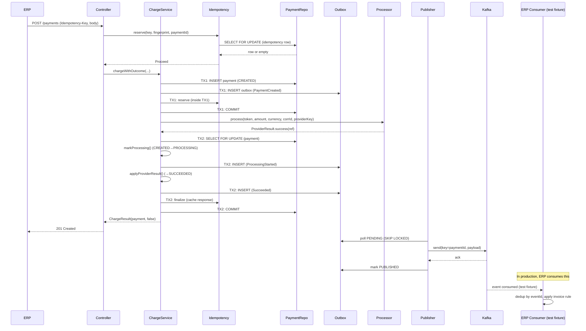
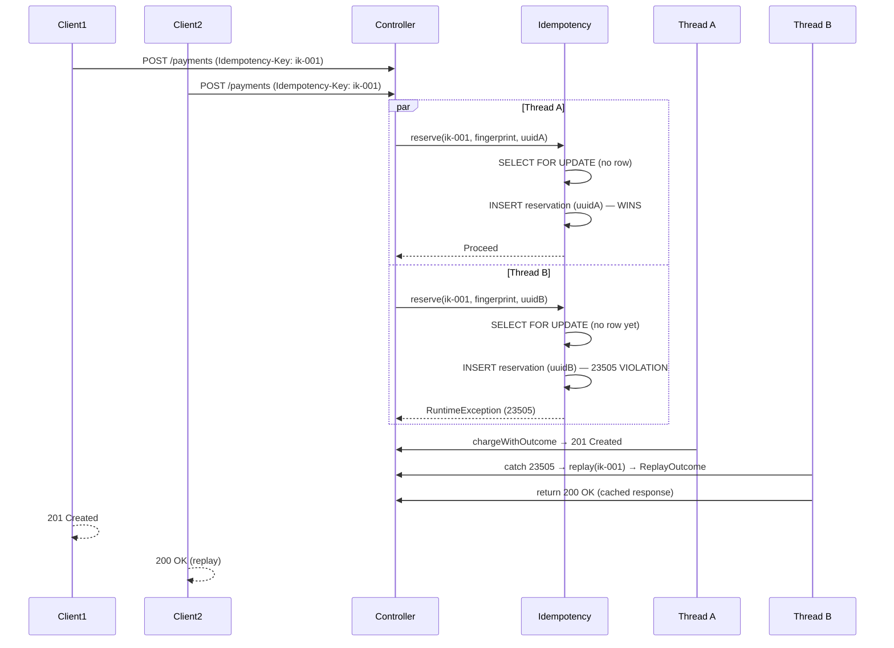
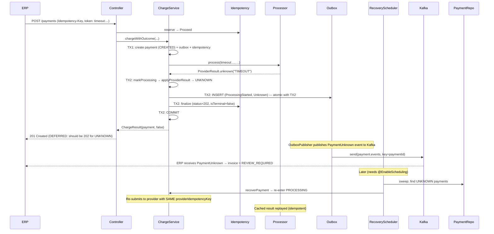
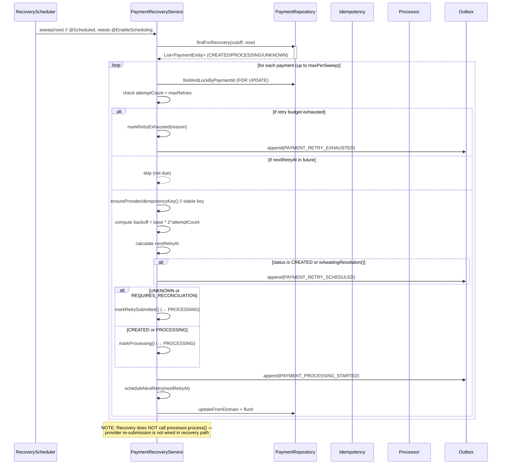

# Full Project Flow — End-to-End Payment Processing

> **Delivery guarantee:** This system provides **at-least-once** event delivery, NOT exactly-once. See the "Delivery Guarantees" section in `docs/stage-5-outbox-kafka-erp.md`.

## Architecture Overview

```
┌─────────────┐   POST /api/v1/payments (Idempotency-Key)    ┌──────────────────────┐
│   ERP       │ ────────────────────────────────────────────▶ │  Payment Gateway     │
│ (external,  │                                              │  & Settlement Core   │
│  owns       │ ◀──────────────────────────────────────────── │  Engine              │
│  invoices)  │   201 Created / 200 Replay / 202 Unknown      │                      │
└─────────────┘                                              │  API (Spring MVC)      │
                                                             │  ChargeService         │
                                                             │  PaymentProcessor SPI │
                                                             │  Idempotency (Postgres) │
                                                             │  RecoveryScheduler     │
                                                             │  OutboxPublisher       │
                                                             └──────────┬───────────┘
                                                                        │
                                                    ┌────────────┬──────┴────────┬────────────┐
                                                    ▼            ▼             ▼            ▼
                                                PostgreSQL   Kafka          Redis       Simulated
                                                (source of   (events)      (cache)     Provider
                                                 truth)                    (optional)   (HTTP SPI)
```

**Data flow (Stage 5 implemented):**
```
Payment API → Payment transaction (TX1/TX2) → Outbox row → Outbox publisher → Kafka → ERP consumer
```

---

## Flow 1: Normal Payment (Happy Path) — `success:` token

### Execution Steps

| Step | Actor | Action | Transaction | DB Effect |
|------|-------|--------|------------|-----------|
| 1 | ERP | `POST /api/v1/payments` with `Idempotency-Key: ik-abc`, `billRef: INV-001`, `amount: 1250.00`, `paymentToken: success:test` | — | — |
| 2 | CorrelationIdFilter | Generates/resolves `X-Correlation-Id`, sets in MDC | — | — |
| 3 | RequestLoggingFilter | Logs incoming request (scrubbed body at DEBUG) | — | — |
| 4 | PaymentController | Validates `@Valid` body, extracts `Idempotency-Key` | — | — |
| 5 | PaymentController | Computes SHA-256 fingerprint of request (token masked) | — | — |
| 6 | PaymentController | Calls `idempotencyService.reserve(merchantId, key, fingerprint, paymentId)` | TX (reserve) | `SELECT FOR UPDATE idempotency` row (if exists) or `INSERT idempotency` reservation row |
| 7 | PaymentController | Checks `reserve` outcome: `Proceed` → continue; `ReplayOutcome` → return cached; `ConflictOutcome` → 409 | — | — |
| 8 | ChargeService.chargeWithOutcome | Validates currency, creates Money, generates PaymentId | — | — |
| 9 | ChargeService | TX1: `transactionTemplate.execute()` | TX1 | `INSERT payment (CREATED)` + `INSERT outbox (PaymentCreated)` + `idempotency.reserve` |
| 10 | ChargeService | Checks for `ReplayDuringReservationException` inside TX1 (race: another request reserved first) | TX1 | If replay exception → rollback, read replayed payment |
| 11 | ChargeService | Calls `processor.process(token, amountMinor, currency, correlationId, providerIdempotencyKey)` | None (outside TX) | No DB locks held |
| 12 | SimulatedPaymentProcessor | Token prefix `success:` → `ProviderResult.success("provider_txn_{correlationId}")` | None | Caches result by providerIdempotencyKey |
| 13 | ChargeService | TX2: `transactionTemplate.execute()` | TX2 | `SELECT FOR UPDATE payment` + `markProcessing()` (CREATED→PROCESSING) + `PaymentProcessingStarted` outbox + `applyProviderResult` (PROCESSING→SUCCEEDED) + `PaymentSucceeded` outbox + `idempotency.finalize` |
| 14 | OutboxPublisher | Polls `outbox` with `FOR UPDATE SKIP LOCKED`, sends to Kafka `payment.events` | Async | Marks rows `PUBLISHED` after Kafka ack |
| 15 | PaymentController | Returns 201 Created with payment response | — | — |

### State Transitions

```
CREATED → PROCESSING → SUCCEEDED
```

### Idempotency Behavior

- **First request:** `reserve()` inserts a provisional row. `finalize()` updates it with the terminal response.
- **Same key + same payload:** `reserve()` returns `ReplayOutcome` → controller returns original response.
- **Same key + different payload (non-terminal):** `reserve()` returns `ConflictOutcome` → 409.

### Transaction Boundaries

- **TX1 (create):** Payment insert + outbox insert (PaymentCreated) + idempotency reservation. Atomic.
- **Provider call:** No DB transaction or lock.
- **TX2 (apply):** Lock payment + state transitions + outbox inserts (ProcessingStarted, Succeeded) + idempotency finalize. Atomic.

### Possible Failure Points

- **Unique constraint violation on idempotency:** Another concurrent request won the race. Controller catches 23505, calls `replay()`, returns cached result.
- **Provider exception:** Caught in `ChargeService` (line 200), converted to `ProviderResult.technicalFailure()`. Payment transitions to `FAILED`.
- **TX2 optimistic lock conflict:** Retried 3x with backoff. If exhausted, throws `ObjectOptimisticLockingFailureException`.
- **Kafka unavailable:** Payment commits successfully. Outbox rows remain `PENDING`. `OutboxPublisher` retries with exponential backoff.

---

## Flow 2: First Payment Creation Request

**Status: IMPLEMENTED**

```
ERP ──POST /api/v1/payments──▶ PaymentController
    ├─ Validate @Valid CreatePaymentRequest
    ├─ IdempotencyKey.of(idempotencyKey)
    ├─ requestFingerprint(body)  // SHA-256, token masked
    ├─ idempotencyService.reserve(merchantId, key, fingerprint, paymentId)
    │   └─ PostgresIdempotencyStore.reserve()
    │       ├─ lockByKey(merchantId, key)  // SELECT FOR UPDATE
    │       └─ If no existing row: insertReservation(...)  // INSERT
    ├─ Check outcome: Proceed → continue
    └─ chargeService.chargeWithOutcome(..., idempotencyKey, paymentId)
         ├─ TX1: Payment.create() → PaymentEntity.fromDomain() → saveAndFlush()
         ├─ OutboxEventService.append(PAYMENT_CREATED)
         ├─ idempotencyService.reserve() again inside TX1
         │   └─ (race detection: ReplayDuringReservationException if conflict)
         ├─ Commit TX1
         ├─ processor.process(token, amount, currency, corrId, providerKey)
         │   └─ SimulatedPaymentProcessor → ProviderResult.success(ref)
         ├─ TX2: findAndLockByPaymentId → markProcessing() → applyProviderResult()
         ├─ OutboxEventService.append(PAYMENT_PROCESSING_STARTED)
         ├─ OutboxEventService.append(PAYMENT_SUCCEEDED)
         ├─ idempotencyService.finalize(...)
         └─ Commit TX2
    └─ Return 201 Created
```

---

## Flow 3: Idempotent Repeated Request (Same Key, Same Payload)

**Status: IMPLEMENTED** (but byte-exact replay is PARTIALLY IMPLEMENTED)

```
ERP ──POST /api/v1/payments──▶ PaymentController
    ├─ IdempotencyKey.of(idempotencyKey)
    ├─ requestFingerprint(body)
    ├─ idempotencyService.reserve(merchantId, key, fingerprint, paymentId)
    │   └─ PostgresIdempotencyStore.reserve()
    │       ├─ lockByKey(merchantId, key)  // SELECT FOR UPDATE → finds existing row
    │       ├─ requestHash matches → return ReplayOutcome(paymentId, 200, body, terminal=true)
    └─ Check outcome: ReplayOutcome → return cached response
```

**Note:** The controller rebuilds the response from the `Payment` domain object (not from the cached `response_body` JSON). This means the response is semantically correct but not byte-for-byte identical to the original. See `docs/stage-5-status.md` "Idempotency response replay body (byte-exact) — NOT IMPLEMENTED".

---

## Flow 4: Same Idempotency Key with Different Payload

**Status: IMPLEMENTED**

```
ERP ──POST /api/v1/payments (different amount)──▶ PaymentController
    ├─ IdempotencyKey.of(idempotencyKey)  // same key
    ├─ requestFingerprint(body)  // different hash
    ├─ idempotencyService.reserve(merchantId, key, newFingerprint, newPaymentId)
    │   └─ PostgresIdempotencyStore.reserve()
    │       ├─ lockByKey(merchantId, key) → finds existing row
    │       ├─ requestHash DOES NOT match fingerprint
    │       ├─ isTerminal? 
    │       │   ├── YES → return ReplayOutcome (terminal replay despite mismatch)
    │       │   └── NO → return ConflictOutcome
    └─ Check outcome: ConflictOutcome → throw IdempotencyKeyConflictException → 409 CONFLICT
```

**HTTP Response:** `409 Conflict` with `error: IDEMPOTENCY_KEY_CONFLICT`.

**Edge case:** If the existing idempotency record is terminal (e.g., payment SUCCEEDED), the store returns a `ReplayOutcome` regardless of payload mismatch — the original result is returned. This is intentional: the payment already completed, rejecting it would be worse UX.

---

## Flow 5: Two Concurrent Requests with Same Idempotency Key

**Status: IMPLEMENTED**

```
Thread A ──reserve()──▶ lockByKey() ──no row──▶ insertReservation() ──COMMIT (wins)
Thread B ──reserve()──▶ lockByKey() ──no row──▶ insertReservation() ──23505 violation

Thread B catches violation in controller:
    catch RuntimeException e:
        if msg.contains("23505") or "unique":
            replay(merchantId, key)
            return cached response (200)
```

**Step-by-step:**

1. Both threads enter `PaymentController.createPayment` concurrently.
2. Both call `idempotencyService.reserve()`.
3. `PostgresIdempotencyStore.reserve()` does `SELECT FOR UPDATE lockByKey()`. Since no row exists, both get `Optional.empty()`.
4. Both proceed to `insertReservation()`. PostgreSQL serializes: one commits, the other gets SQL state 23505 (unique violation).
5. Thread A commits its reservation. TX1 proceeds: payment insert + outbox + idempotency reserve (already done).
6. Thread B's `insertReservation` throws (or the `reserve()` inside TX1 catches it). The controller catches the `RuntimeException` (line 117), checks for "23505"/"unique" in the message, and calls `idempotencyService.replay()`.
7. Thread B gets `ReplayOutcome` from Thread A's committed payment and returns 200.

**Why this is safe:** The database unique constraint is the ultimate arbiter. Even if both threads pass the `SELECT FOR UPDATE` (because no row exists yet), only one `INSERT` succeeds.

---

## Flow 6: Payment Processing Flow (Provider Call)

**Status: IMPLEMENTED**

```
ChargeService.chargeWithOutcome:
    TX1 commits (payment in CREATED, outbox PaymentCreated, idempotency reserved)
    
    // Provider call — OUTSIDE any transaction
    ProviderResult result = processor.process(
        paymentToken,         // e.g. "success:test"
        amountMinor,          // e.g. 125000
        currency,             // e.g. "INR"
        correlationId,        // UUID
        providerIdempotencyKey // "prov_<paymentId>"
    )
    
    TX2:
    ├─ findAndLockByPaymentId(paymentId)  // SELECT FOR UPDATE
    ├─ Payment.markProcessing()          // CREATED → PROCESSING
    ├─ OutboxEventService.append(PAYMENT_PROCESSING_STARTED)
    ├─ Payment.applyProviderResult(result)  // PROCESSING → SUCCEEDED/FAILED/UNKNOWN
    ├─ OutboxEventService.append(PAYMENT_SUCCEEDED | FAILED | UNKNOWN)
    ├─ idempotencyService.finalize(...)     // cache response
    └─ Commit TX2
```

**Key design decision:** The provider call happens *outside* any DB transaction. This prevents:
- Holding `SELECT FOR UPDATE` locks during slow network I/O
- Transaction timeouts from long provider responses
- Deadlock risk from holding locks across external calls

---

## Flow 7: Provider Success

**Status: IMPLEMENTED**

```
SimulatedPaymentProcessor.process("success:test", 125000, "INR", corrId, "prov_abc")
    ├─ Token prefix: "success"
    ├── First call: cache result → ProviderResult(Type.SUCCESS, "provider_txn_{corrId}", null, null)
    └── Return success result

ChargeService.applyProviderResult:
    ├─ Payment.markProcessing()          // CREATED → PROCESSING
    ├─ payment.applyProviderResult(ProviderResult.success(...))
    │   ├─ PaymentStateEngine.transition(PROCESSING, SUCCEEDED, PROVIDER_SUCCESS)
    │   ├─ providerReference = "provider_txn_{corrId}"
    │   └─ status = SUCCEEDED (terminal)
    ├─ OutboxEventService.append(PAYMENT_SUCCEEDED, PROCESSING, "PROVIDER_SUCCESS")
    ├─ idempotencyService.finalize(..., 200, responseBody, true)  // isTerminal=true
    └─ Return 200 OK (or 201 for non-replay)
```

---

## Flow 8: Provider Failure (Decline or Technical Failure)

**Status: IMPLEMENTED**

### Decline (token: `decline:`)

```
SimulatedPaymentProcessor → ProviderResult.declined("DECLINED", "Simulator: declined by provider")

ChargeService.applyProviderResult:
    ├─ Payment.markProcessing()          // CREATED → PROCESSING
    ├─ payment.applyProviderResult(result)
    │   ├─ PaymentStateEngine.transition(PROCESSING, FAILED, PROVIDER_DECLINED)
    │   └─ status = FAILED (terminal)
    ├─ OutboxEventService.append(PAYMENT_FAILED, PROCESSING, "PROVIDER_DECLINED")
    ├─ idempotencyService.finalize(..., 200, responseBody, true)
    └─ Return 200 OK with status=FAILED
```

### Technical Failure (token: `error500:` or `connfail:`)

Same as decline, but `reasonCode = PROVIDER_TECHNICAL_FAILURE`, `failureCode = PROVIDER_ERROR` or `CONNECTION_ERROR`.

**Safety:** Both `DECLINED` and `TECHNICAL_FAILURE` map to `FAILED`, which is safe because **no money moved** — the provider explicitly did not charge the customer.

---

## Flow 9: Provider Timeout

**Status: IMPLEMENTED** (timeout simulated via `timeout:` token returning `ProviderResult.unknown()`)

```
SimulatedPaymentProcessor("timeout:test", ...) → ProviderResult.unknown("TIMEOUT", "Simulator: provider timeout")

ChargeService.applyProviderResult:
    ├─ Payment.markProcessing()          // CREATED → PROCESSING
    ├─ payment.applyProviderResult(result)
    │   ├─ mapResultToStatus(UNKNOWN) → PaymentStatus.UNKNOWN
    │   ├─ PaymentStateEngine.transition(PROCESSING, UNKNOWN, PROVIDER_UNKNOWN_OUTCOME)
    │   └─ status = UNKNOWN (non-terminal)
    ├─ OutboxEventService.append(PAYMENT_UNKNOWN, PROCESSING, "PROVIDER_UNKNOWN_OUTCOME")
    ├─ idempotencyService.finalize(..., 202, responseBody, false)  // isTerminal=false
    └─ Return 202 ACCEPTED with status=UNKNOWN
```

**Why timeout ≠ failure:** The provider may have debited the customer but timed out before responding. Retrying with a *new* idempotency key would risk double-charging. Returning `UNKNOWN` (non-terminal) prevents this.

**Current limitation:** The controller at line 151 returns `HttpStatus.CREATED` (201) for new, not 202 for UNKNOWN. The `ChargeResult.responseStatus` computes 202 (line 440), but the controller only checks `replayed` (line 151): `responseStatus(replayed ? OK : CREATED)`. See `docs/stage-5-status.md:70`: "HTTP status for UNKNOWN (202) — DEFERRED".

---

## Flow 10: Application Crash Before Provider Call

**Status: IMPLEMENTED**

```
1. TX1 commits: payment in CREATED, idempotency reserved, outbox PaymentCreated written
2. App crashes BEFORE calling processor.process()
3. App restarts → RecoveryScheduler.runRecoverySweep() fires (if @EnableScheduling is present)
4. PaymentRecoveryService.sweep() finds payment in CREATED with created_at < cutoff
5. recoverPayment(): re-enters PROCESSING, calls processor.process() with same providerIdempotencyKey
6. If provider returns SUCCESS → TX2 applies SUCCEEDED, finalizes idempotency
```

**Safety guarantees:**
- Idempotency key is already reserved → client retry is safe (returns cached/replayed result)
- Provider idempotency key is stable (`prov_<paymentId>`) → provider won't double-charge
- `@Version` prevents lost updates during TX2

---

## Flow 11: Application Crash After Provider Call

**Status: IMPLEMENTED**

```
1. TX1 commits: payment in CREATED, idempotency reserved
2. Provider call succeeds → ProviderResult.success(ref)
3. App crashes BEFORE TX2 commits
4. App restarts
5. RecoveryScheduler finds payment in CREATED (or PROCESSING if markProcessing persisted)
6. Recovery re-submits to provider with same idempotency key
7. SimulatedPaymentProcessor replays cached result
8. TX2 applies result, finalizes idempotency
```

**Edge case:** If TX2 partially committed (payment updated but idempotency not finalized), the idempotency record remains provisional (status 202, body `{}`). Recovery re-submits with the same provider key, gets the same result, and re-applies it. The `applyProviderResult` is idempotent (no-op if already terminal).

---

## Flow 12: Retry After Timeout

**Status: IMPLEMENTED** (via recovery scheduler)

```
1. Payment is UNKNOWN after timeout
2. RecoveryScheduler fires (if @EnableScheduling present)
3. PaymentRecoveryService.recoverPayment():
   a. Checks attemptCount < maxRetries (default 3)
   b. Checks nextRetryAt <= now (exponential backoff)
   c. Appends PaymentRetryScheduled outbox event
   d. Calls payment.markRetrySubmitted() → UNKNOWN → PROCESSING
   e. Appends PaymentProcessingStarted outbox event
   f. Updates payment: status=PROCESSING, attemptCount++, nextRetryAt=now+backoff
4. (Retry re-submission to provider is NOT in the current recovery code)
   See note below.
```

**Important note:** The current `PaymentRecoveryService.recoverPayment()` re-enters `PROCESSING` and appends outbox events, but does **NOT** call `processor.process()` to re-submit to the provider. This means recovery schedules the retry and transitions to PROCESSING, but the actual provider re-submission is **not implemented** in the recovery path. The provider call only happens in `ChargeService.chargeWithOutcome()`. This is a **gap** — recovery marks the payment as PROCESSING and schedules a retry, but doesn't actually re-attempt the provider call.

**Interview talking point:** "Recovery re-enters PROCESSING and schedules a retry with exponential backoff, but the actual provider re-submission logic needs to be wired into the recovery path. Currently, only the initial charge flow calls `processor.process()`."

---

## Flow 13: Retry After Application Restart

**Status: IMPLEMENTED** (recovery is data-driven, persists across restarts)

```
1. App restarts
2. RecoveryScheduler fires (needs @EnableScheduling)
3. PaymentRecoveryService queries PostgreSQL for non-terminal payments
   with created_at < cutoff and next_retry_at <= now
4. All retry metadata (attemptCount, nextRetryAt, providerIdempotencyKey) is persisted
   in the payment row → survives restart
5. Recovery proceeds as normal retry
```

**Key point:** All state is in PostgreSQL. Redis is only a cache. A Redis restart or cold start doesn't affect recovery correctness.

---

## Flow 14: Retry Exhaustion

**Status: IMPLEMENTED**

```
1. Payment in UNKNOWN (from timeout)
2. RecoveryScheduler fires
3. PaymentRecoveryService.recoverPayment():
   a. attemptCount (e.g. 3) >= maxRetries (default 3)
   b. payment.markRetryExhausted("Retry budget exhausted after 3 attempts")
   c. Appends PaymentRetryExhausted outbox event
   d. Does NOT change status (remains UNKNOWN)
4. Payment stays in UNKNOWN with lastFailureReason set
5. Payment visible for manual investigation
```

**Current behavior:** On retry exhaustion, the payment is NOT marked terminal — it remains in `UNKNOWN` (or its current non-terminal state) with the exhaustion reason recorded. This is by design: the payment may still be resolvable by a future reconciliation pass.

---

## Flow 15: UNKNOWN Payment Flow

**Status: IMPLEMENTED**

```
1. Provider returns ProviderResult.unknown()
2. Payment transitions PROCESSING → UNKNOWN
3. Outbox event PaymentUnknown appended
4. Idempotency finalized with responseStatus=202, isTerminal=false
5. Payment is non-terminal, inPaymentRecoveryService.sweep finds it
6. Recovery can re-submit (UNKNOWN → PROCESSING → retry)
7. If reconciliation job exists (Stage 6): resolveReconciliation(SUCCEEDED/FAILED)
```

**REQUIRES_RECONCILIATION:** Same flow, but entered via `PROCESSING → REQUIRES_RECONCILIATION` (when `ProviderResult.Type.TECHNICAL_FAILURE` — see state machine). Recovery handles it identically to UNKNOWN.

---

## Flow 16: REQUIRES_RECONCILIATION Flow

**Status: PARTIALLY IMPLEMENTED**

The state machine supports `REQUIRES_RECONCILIATION` with exit transitions to `SUCCEEDED`, `FAILED`, and `PROCESSING` (retry). However:

1. **How it's entered:** `PaymentStateEngine.transition(PROCESSING, REQUIRES_RECONCILIATION, PROVIDER_TECHNICAL_FAILURE)` is allowed but `Payment.applyProviderResult()` only maps `TECHNICAL_FAILURE → FAILED` (line 295-296), not to `REQUIRES_RECONCILIATION`. So **no current code path produces `REQUIRES_RECONCILIATION`**.

2. **Recovery:** `PaymentRecoveryService` handles `REQUIRES_RECONCILIATION` (line 184-187) — treats it like `UNKNOWN`, re-enters `PROCESSING`.

3. **Reconciliation:** The `Payment.resolveReconciliation()` method exists (line 245) but is **not called by any active code path**. It would be invoked by a reconciliation polling job (Stage 6).

**docs/stage-5-status.md:78:** "No event is invented for an unsupported transition."

---

## Flow 17: ERP Initiation Flow

**Status: IMPLEMENTED**

```
ERP (external system, owns invoices):
1. Generates bill INV-2024-00743, amount ₹1,250.00
2. User selects UPI in ERP UI
3. ERP calls: POST /api/v1/payments
   Headers:
     Idempotency-Key: ik-abc-123      (merchant-scoped, required)
     X-Correlation-Id: corr-001      (optional, generated if absent)
     Content-Type: application/json
   Body:
     {
       "merchantId": "m_5f2e",
       "customerRef": "c_8812",
       "billRef": "INV-2024-00743",
       "amount": "1250.00",
       "currency": "INR",
       "paymentMethod": "UPI",
       "paymentToken": "upi://pay/xyz@kok"  // never persisted or returned
     }
```

**Key points:**
- The gateway does NOT own invoice data — `billRef` is an opaque reference the ERP uses to correlate.
- `customerRef` is also opaque — the gateway doesn't query/validate it.
- The ERP can poll `GET /api/v1/payments/{paymentId}` or consume Kafka events (if ERP implements a consumer).

---

## Flow 18: Payment Result Returned to ERP

**Status: IMPLEMENTED (HTTP response) + PARTIALLY IMPLEMENTED (Kafka events)**

### HTTP Response (IMPLEMENTED)

```
PaymentController.createPayment returns:
- 201 Created: new payment (first request)
- 200 OK: idempotent replay (same key + same payload)
- 202 Accepted: UNKNOWN outcome (DEFERRED — currently returns 201)
- 409 Conflict: idempotency conflict or illegal state transition
- 400 Bad Request: validation or business rule failure
- 404 Not Found: payment not found
- 500 Internal Server Error: unexpected failure
```

### Kafka Events (PARTIALLY IMPLEMENTED — producer only)

The gateway **publishes** events to `payment.events`:
1. `PaymentCreated` — when payment is created in CREATED
2. `PaymentProcessingStarted` — when payment transitions CREATED → PROCESSING
3. `PaymentSucceeded` / `PaymentFailed` / `PaymentUnknown` — terminal/unknown result
4. `PaymentRetryScheduled` — when recovery schedules a retry
5. `PaymentRetryExhausted` — when retry budget is exhausted

**The ERP consumer is NOT IMPLEMENTED.** Only `ErpPaymentEventFixture` (a test double) consumes events. See `docs/stage-5-status.md:78`.

---

## Flow 19: Stage 5 Outbox / Kafka Flow

**Status: PARTIALLY IMPLEMENTED**

```
ChargeService (TX1/TX2):
  1. Payment created → OutboxEventEntity appended (PaymentCreated)
  2. Payment PROCESSING → OutboxEventEntity appended (ProcessingStarted)
  3. Payment terminal → OutboxEventEntity appended (Succeeded/Failed/Unknown)
  └─ All in same PostgreSQL transaction as payment state change

OutboxEventEntity status = PENDING, next_attempt_at = now()

OutboxPublisher (scheduled, @Scheduled):
  1. publishDueEvents() polls:
     SELECT * FROM outbox WHERE status='PENDING' 
       AND next_attempt_at <= now()
       AND NOT EXISTS (earlier pending event for same payment)
     ORDER BY event_order FOR UPDATE SKIP LOCKED
  2. For each row:
     a. claim() — CAS on lock_owner
     b. Deserialize PaymentLifecycleEvent from JSON payload
     c. kafkaTemplate.send(topic, eventKey=paymentId, payload)
     d. .get(sendTimeout) — block for Kafka ack
     e. markPublished() — if ack received
     f. handleFailure() — if ack failed or timed out:
        - attempt_count++
        - if attempt_count >= max_attempts (10): send to DLQ
        - else: exponential backoff, next_attempt_at = now + backoff
  3. Repeat

Kafka:
  - Topic: payment.events (6 partitions, 7-day retention)
  - DLQ: payment.events.DLQ (1 partition)
  - Producer: acks=all, enable.idempotence=true
  - Message key: payment UUID string (ensures per-payment partition)
```

**GAP:** `@EnableScheduling` is not on the main application class. The `@Scheduled` methods on `OutboxPublisher` and `RecoveryScheduler` will NOT fire in a running application. Tests call `publisher.publishDueEvents()` directly. See `docs/stage-5-status.md:71`.

---

## Mermaid Diagrams

### Normal Payment Sequence



### Idempotency Sequence (Concurrent Duplicates)



### Provider Timeout Sequence



### Recovery Sequence



### High-Level Architecture

```mermaid
graph TB
    subgraph "External"
        ERP[ERP (owns invoices)]
    end
    
    subgraph "Payment Gateway & Settlement Core Engine"
        API[API Layer<br/>PaymentController]
        Service[Application Layer<br/>ChargeService<br/>PaymentRecoveryService<br/>OutboxEventService]
        Domain[Domain Layer<br/>Payment aggregate<br/>PaymentStateEngine<br/>Money<br/>ProviderResult]
        Ports[Ports<br/>PaymentProcessor<br/>IdempotencyService]
        
        subgraph "Infrastructure"
            InfraRepo[(JPA Repositories<br/>PaymentRepository<br/>IdempotencyRepository<br/>OutboxEventRepository)]
            InfraProvider[SimulatedPaymentProcessor]
            InfraIdempotency[PostgresIdempotencyStore]
            InfraOutbox[OutboxPublisher<br/>KafkaOutboxConfiguration]
            InfraScheduler[RecoveryScheduler]
        end
        
        Obs[Observability<br/>CorrelationIdFilter<br/>RequestLoggingFilter<br/>OutboxMetrics]
    end
    
    subgraph "Data Stores"
        PG[(PostgreSQL<br/>source of truth)]
        Kafka[(Kafka<br/>payment.events)]
        Redis[(Redis<br/>cache only)]
    end
    
    ERP -->|POST /payments| API
    API --> Service
    Service --> Domain
    Service --> Ports
    Ports --> InfraProvider
    Ports --> InfraIdempotency
    Service --> InfraOutbox
    Service --> InfraRepo
    Service --> InfraScheduler
    InfraScheduler --> Service
    InfraOutbox --> Kafka
    InfraRepo --> PG
    InfraIdempotency --> PG
    Obs -->|logs/metrics| PG
    Obs -->|logs/metrics| Kafka
    
    classDef external fill:#e1f5fe
    classDef gateway fill:#f5f5f5
    classDef infra fill:#fff3e0
    classDef data fill:#e8f5e9
    
    class ERP external
    class API,Service,Domain,Ports,Obs gateway
    class InfraRepo,InfraProvider,InfraIdempotency,InfraOutbox,InfraScheduler infra
    class PG,Kafka,Redis data
```

---

## Transaction Boundary Summary

| Phase | Transaction | What's persisted | Lock held | Duration |
|-------|-------------|-----------------|-----------|----------|
| TX1 (Create) | `TransactionTemplate.execute` | PaymentEntity (CREATED), OutboxEventEntity (PaymentCreated), IdempotencyEntity (reserv) | Idempotency row (SELECT FOR UPDATE) | ~50ms (2 inserts) |
| Provider Call | **None** | — | **None** | Variable (network latency) |
| TX2 (Apply) | `TransactionTemplate.execute` | PaymentEntity (updated), OutboxEventEntity (2+ events), IdempotencyEntity (finalize) | Payment row (SELECT FOR UPDATE) | ~50-100ms |
| Idempotency Reserve (fast path) | `@Transactional` in `PostgresIdempotencyStore.reserve` | IdempotencyEntity (reserv) | Idempotency row (SELECT FOR UPDATE) | ~10ms |

---

## Idempotency Behavior Summary

| Scenario | Controller Behavior | DB Effect | HTTP Response |
|----------|-------------------|-----------|---------------|
| First request | `reserve()` → `Proceed` | INSERT idempotency + payment + outbox | 201 Created |
| Replay (same key+payload) | `reserve()` → `ReplayOutcome` | Read only | 200 OK |
| Conflict (same key, diff payload, non-terminal) | `reserve()` → `ConflictOutcome` | Read only | 409 Conflict |
| Conflict (same key, diff payload, terminal) | `reserve()` → `ReplayOutcome` | Read only | 200 OK |
| Concurrent race (23505 on insert) | Catch exception → `replay()` | INSERT failed (rolled back) | 200 OK (cached) |

---

## State Transition Summary

| From | To | Trigger | Transaction |
|------|-----|---------|-------------|
| CREATED | PROCESSING | `markProcessing()` (in TX2) | TX2 |
| PROCESSING | SUCCEEDED | `applyProviderResult(SUCCESS)` | TX2 |
| PROCESSING | FAILED | `applyProviderResult(DECLINED/TECHNICAL_FAILURE)` | TX2 |
| PROCESSING | UNKNOWN | `applyProviderResult(UNKNOWN)` | TX2 |
| PROCESSING | REQUIRES_RECONCILIATION | `applyProviderResult(TECHNICAL_FAILURE)` | TX2 |
| UNKNOWN | PROCESSING | `markRetrySubmitted()` (recovery) | Recovery TX |
| UNKNOWN | SUCCEEDED | `resolveReconciliation()` (Stage 6) | TBR |
| UNKNOWN | FAILED | `resolveReconciliation()` (Stage 6) | TBR |
| REQUIRES_RECONCILIATION | PROCESSING | `markRetrySubmitted()` (recovery) | Recovery TX |
| REQUIRES_RECONCILIATION | SUCCEEDED | `resolveReconciliation()` (Stage 6) | TBR |
| REQUIRES_RECONCILIATION | FAILED | `resolveReconciliation()` (Stage 6) | TBR |

**No backwards transitions from terminal states.** All enforced by `PaymentStateEngine.transition()`.

---

## Recovery Behavior Summary

| Trigger | Payment State | Recovery Action | Outbox Events |
|---------|---------------|-----------------|---------------|
| Scheduled sweep | CREATED (stale) | Re-enter PROCESSING | PaymentRetryScheduled + ProcessingStarted (if applicable) |
| Scheduled sweep | PROCESSING (stuck) | Re-enter PROCESSING | PaymentRetryScheduled + ProcessingStarted |
| Scheduled sweep | UNKNOWN | Re-enter PROCESSING | PaymentRetryScheduled + ProcessingStarted |
| Scheduled sweep | REQUIRES_RECONCILIATION | Re-enter PROCESSING | PaymentRetryScheduled + ProcessingStarted |
| Max retries reached | Any non-terminal | markRetryExhausted (no status change) | PaymentRetryExhausted |
| Crash before TX1 commit | CREATED (not committed) | Nothing (TX rolled back) | None |
| Crash after TX1 commit | CREATED | Recovery re-submits | PaymentRetryScheduled + ProcessingStarted |
| Crash after provider call | PROCESSING | Recovery re-submits | PaymentRetryScheduled + ProcessingStarted |

**IMPORTANT:** Recovery does **NOT** call `processor.process()` — the actual provider re-submission needs to be wired into the recovery path. This is a **gap** in the current implementation.

---

## Known Implementation Gaps and Issues

1. **`@EnableScheduling` missing** (line 71 of stage-5-status.md): `@Scheduled` methods on `OutboxPublisher` and `RecoveryScheduler` will not auto-fire. Tests invoke directly.
2. **Compile errors** (stage-5-status.md:28-31): `ReplayDuringReservationException` not defined, `ChargeResult` arity mismatch, `chargeWithOutcome` arg count mismatch.
3. **`ApplicationContextTest` broken** (stage-5-status.md:94-98): Excludes JPA config → `IdempotencyRepository` not available.
4. **Byte-exact replay not implemented** (stage-5-status.md:79): Controller rebuilds response from Payment, not cached JSON.
5. **HTTP 202 for UNKNOWN not wired** (stage-5-status.md:70): Controller returns 201, not 202 for UNKNOWN status.
6. **No ERP consumer** (stage-5-status.md:78): Consumer factory defined but no `@KafkaListener`.
7. **Recovery doesn't call processor** (this document): Re-enters PROCESSING but doesn't re-submit to provider.
8. **REQUIRES_RECONCILIATION unreachable** (this document): No code path produces this state — `applyProviderResult` maps `TECHNICAL_FAILURE → FAILED`, not `→ REQUIRES_RECONCILIATION`.